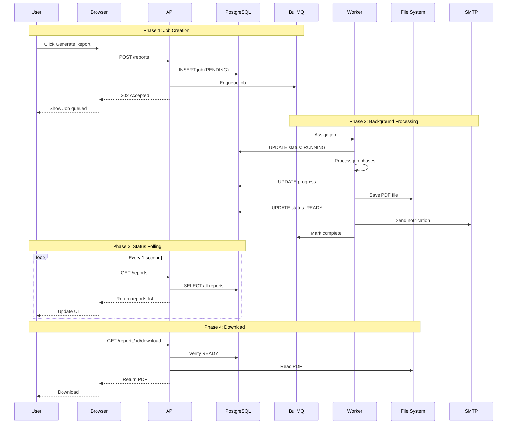
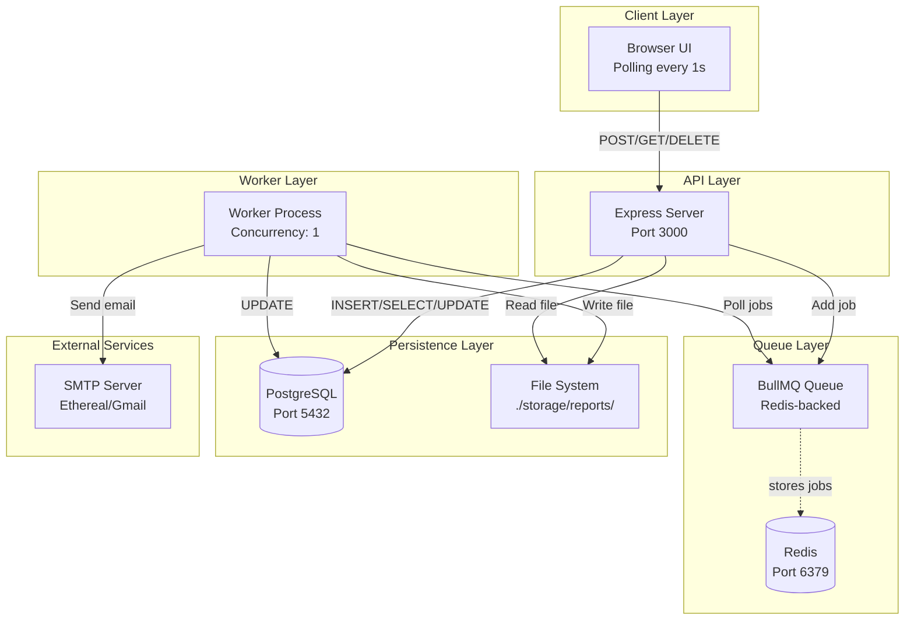
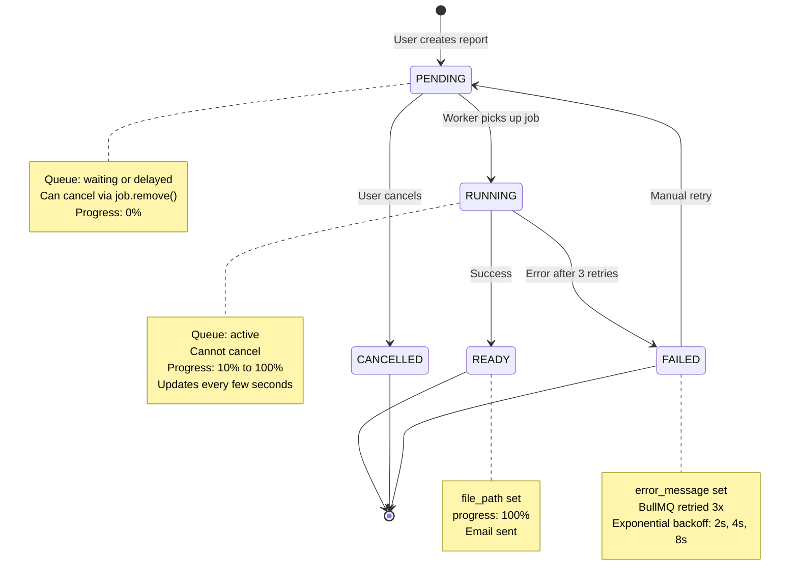
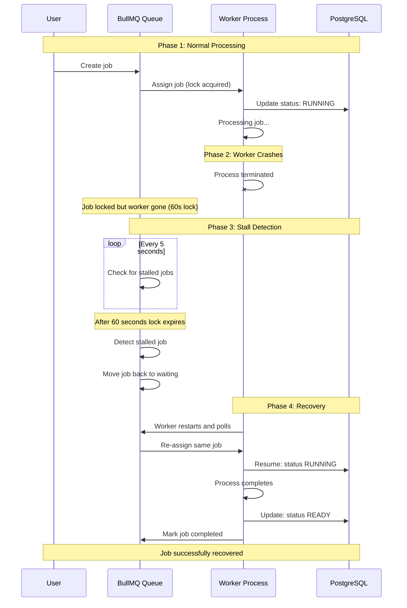

# Background Job Processing with BullMQ

A demonstration of background job processing using BullMQ (Redis-based job queue) for asynchronous PDF report generation with PostgreSQL state management and local file storage.

## Table of Contents

1. [Overview](#overview)
2. [Features](#features)
3. [Architecture](#architecture)
   - [System Overview](#system-overview)
   - [Job Lifecycle](#job-lifecycle)
   - [Crash Recovery](#crash-recovery)
4. [UI Preview](#ui-preview)
5. [Learning Outcomes](#learning-outcomes)
6. [Tech Stack](#tech-stack)
7. [Getting Started](#getting-started)
   - [Prerequisites](#prerequisites)
   - [Setup](#setup)
   - [Running the API and Worker](#running-the-api-and-worker)
   - [Available Scripts](#available-scripts)
8. [API Endpoints](#api-endpoints)
9. [Testing the Flow](#testing-the-flow)
10. [Future Improvements](#future-improvements)

---

## Overview

This project demonstrates a complete **job queue system** for background processing using BullMQ. It showcases how to:
- Offload CPU-intensive tasks (PDF generation) to background workers
- Handle job retries and failures gracefully
- Recover from worker crashes with stall detection
- Provide real-time status updates to users
- Maintain job state in PostgreSQL while using Redis for queue management

**Use case**: Generate PDF reports asynchronously without blocking the API, with email notifications when complete.

---

## Demo


https://github.com/user-attachments/assets/5a043407-1d43-4e59-b8cb-c9ee4b36b014

---

## Features

- **Background Job Processing** - Offload PDF generation to worker process without blocking API
- **Job Queue with BullMQ** - Redis-backed queue with automatic retries and stall detection
- **Job Cancellation** - Cancel pending jobs before processing starts
- **Progress Tracking** - Real-time status updates (PENDING → RUNNING → READY/FAILED)
- **Error Recovery** - Automatic retries (3 attempts) and manual retry from UI
- **Email Notifications** - Send download links via SMTP when reports are ready
- **Simple Web UI** - Monitor jobs, view progress, download PDFs, handle failures

---

## Architecture

### System Overview

**Request Flow:**



**Layered Architecture:**



**Key Components:**
- **Client** - Simple HTML/JS UI with auto-refresh polling
- **API** - REST endpoints (create, list, download, cancel)
- **Queue** - BullMQ manages job distribution, retries, and stall detection
- **Worker** - Separate process that consumes jobs from the queue
- **Data** - PostgreSQL for job metadata, filesystem for PDF files
- **External** - SMTP for email notifications when jobs complete

### Job Lifecycle


### Crash Recovery

**What happens when the worker crashes?**



**BullMQ handles recovery automatically:**
- **`lockDuration: 60000ms`** - Job lock expires after 60 seconds
- **`stalledInterval: 5000ms`** - Checks for stalled jobs every 5 seconds
- **`maxStalledCount: 2`** - Allows up to 2 stalls before marking job as failed
- **`attempts: 3`** - Retries failed jobs up to 3 times with [exponential backoff](https://docs.bullmq.io/guide/retrying-failing-jobs) (2s, 4s, 8s delays)

---

## UI Preview

Open http://localhost:3000 to see:
- **Reports List** - All reports with real-time status updates
- **Status Badges** - Color-coded states (PENDING, RUNNING, READY, FAILED)
- **Progress Bar** - Live progress updates during generation
- **Actions** - Download completed reports, cancel pending jobs, retry failed jobs
- **Search and Filter** - Find reports by ID or filter by status

**Status Updates:**
- **PENDING** - Waiting in queue
- **RUNNING** - Being processed (with progress %)
- **READY** - Complete, ready to download
- **FAILED** - Error occurred (with retry option)
- **CANCELLED** - Removed from queue

---

## Learning Outcomes

This POC demonstrates key concepts in distributed systems and background job processing:

**What is a Job Queue?**
- **Asynchronous processing** - Jobs are enqueued immediately while actual work happens in the background
- **Decoupled architecture** - API and worker processes are independent
- **Reliable execution** - Jobs persist in Redis and are guaranteed to be processed
- **Non-blocking** - API responds instantly without waiting for slow operations

**How It Works:**
- **Producer-consumer pattern** - API produces jobs, worker processes consume them
- **BullMQ job states** - Jobs transition through waiting → active → completed/failed
- **Process isolation** - API and worker run as separate Node.js processes
- **Independent scaling** - Can run multiple workers without changing API code

**Reliability Features:**
- **Automatic retries** - Failed jobs retry 3 times with exponential backoff (2s, 4s, 8s)
- **Stall detection** - Jobs locked for 60s, checked every 5s for recovery
- **Idempotency checks** - Worker skips already-completed jobs
- **Job locking** - BullMQ ensures only one worker processes each job

**State Management:**
- **Dual storage** - Redis for queue, PostgreSQL for job state
- **Status tracking** - PENDING → RUNNING → READY/FAILED/CANCELLED
- **Progress updates** - Track 0% to 100% with messages
- **Persistence** - Job state survives restarts

**Want to Learn More?**
- [BullMQ Documentation](https://docs.bullmq.io/) - Job queue with automatic retries, stall detection, and exponential backoff
- [Redis Documentation](https://redis.io/docs/) - In-memory data store powering BullMQ's job queue
- [PostgreSQL Documentation](https://www.postgresql.org/docs/) - Relational database for persistent job state
- [Microsoft - Web-Queue-Worker Architecture](https://learn.microsoft.com/en-us/azure/architecture/guide/architecture-styles/web-queue-worker) - Architecture pattern used in this project
- [Microsoft - Competing Consumers Pattern](https://learn.microsoft.com/en-us/azure/architecture/patterns/competing-consumers) - How multiple workers can process from the same queue

---

## Tech Stack

| Component | Technology | Purpose |
|-----------|-----------|---------|
| **API** | [Express](https://expressjs.com/) and TypeScript | HTTP endpoints and job enqueue |
| **Job Queue** | [BullMQ](https://docs.bullmq.io/) + [Redis](https://redis.io/) | Reliable background job processing |
| **Database** | [PostgreSQL](https://www.postgresql.org/) | Persistent job state and metadata |
| **Worker** | Node.js (separate process) | PDF generation and email sending |
| **PDF Generation** | [PDFKit](https://pdfkit.org/) | Create PDF documents |
| **Email** | [Nodemailer](https://nodemailer.com/) | SMTP notifications |
| **Storage** | Local filesystem | Store generated PDFs |
| **Frontend** | Vanilla JS | Simple UI for demonstration |
| **Container** | [Docker Compose](https://docs.docker.com/compose/) | PostgreSQL + Redis setup |

**Database Schema:**
```sql
CREATE TABLE report_requests (
  id UUID PRIMARY KEY DEFAULT gen_random_uuid(),
  status VARCHAR(20) NOT NULL DEFAULT 'PENDING' 
    CHECK (status IN ('PENDING', 'RUNNING', 'READY', 'FAILED', 'CANCELLED')),
  progress INTEGER DEFAULT 0 CHECK (progress >= 0 AND progress <= 100),
  progress_message TEXT,
  file_path VARCHAR(500),
  error_message TEXT,
  created_at TIMESTAMPTZ NOT NULL DEFAULT NOW(),
  updated_at TIMESTAMPTZ NOT NULL DEFAULT NOW()
);
```

---

## Getting Started

### Prerequisites

- **Node.js** 24.11.1 (LTS) or higher - [Download Node.js](https://nodejs.org/)
- **[Docker](https://docs.docker.com/get-docker/) and [Docker Compose](https://docs.docker.com/compose/install/)**

**Node.js Version Management:**

This project uses [Node.js 24.11.1 "Krypton"](https://nodejs.org/en/blog/release/v24.11.1) (Latest LTS). We recommend using **nvm** (Node Version Manager) - [Install nvm](https://github.com/nvm-sh/nvm#installing-and-updating)

With nvm installed, the correct version will be automatically selected when you `cd` into the project directory.

### Setup

```bash
# 1. Clone the repository
git clone https://github.com/berTrindade/bullmq-report-generator.git
cd bullmq-report-generator

# 2. Ensure you're using the correct Node.js version
nvm use

# Verify Node.js version
node --version  # Should show v24.11.1 or higher

# 3. Start PostgreSQL and Redis
docker-compose up -d

# 3. Install dependencies
npm install

# 4. Configure email for testing
# Generate free test credentials at https://ethereal.email/create
cp .env.example .env
# Edit .env and add your Ethereal Email credentials
```

**Environment Variables:**

The defaults work out of the box. You only need to configure email if you want to test notifications.

```bash
# Database (defaults work with Docker Compose)
DB_HOST=localhost
DB_PORT=5432
DB_NAME=reports_db
DB_USER=postgres
DB_PASSWORD=password

# Redis (defaults work with Docker Compose)
REDIS_HOST=localhost
REDIS_PORT=6379

# Application
APP_PORT=3000
APP_BASE_URL=http://localhost:3000
STORAGE_DIR=./storage/reports
```

**Email Setup:**

For testing email notifications, use **[Ethereal Email](https://ethereal.email)** - a fake SMTP service that captures emails for testing:

1. Go to **https://ethereal.email/create**
2. Ethereal generates temporary credentials instantly (no signup required)
3. Copy the **SMTP credentials** shown on the page
4. Add them to your `.env` file:

```bash
# Ethereal Email (for testing - emails captured in test inbox)
EMAIL_HOST=smtp.ethereal.email
EMAIL_PORT=587
EMAIL_USER=your-generated-user@ethereal.email
EMAIL_PASS=your-generated-password
EMAIL_FROM=noreply@example.com  # Any email address (not provided by Ethereal)
```

5. View captured emails at the inbox URL provided by Ethereal

**Why Ethereal?**
- No signup required
- Instant credentials
- Safe for demos (no real emails sent to actual recipients)
- Web interface to view captured emails
- Perfect for development and testing

### Running the API and Worker

**Terminal 1 - API Server:**
```bash
npm run dev:api
```

**Terminal 2 - Worker Process:**
```bash
npm run dev:worker
```

**Open the UI:**
```bash
open http://localhost:3000
```

**Stop services:**
```bash
docker-compose down
```

### Available Scripts

| Script | Command | Description |
|--------|---------|-------------|
| **API Server** | `npm run dev:api` | Start API server with hot reload (port 3000) |
| **Worker Process** | `npm run dev:worker` | Start background worker with hot reload |
| **Build** | `npm run build` | Compile TypeScript to JavaScript |
| **Clean** | `npm run clean` | Clear all jobs, queue, and generated files |

**Development Tools:**
- **[tsx](https://tsx.is/)** - TypeScript execution with hot reload (no build step needed)
- **TypeScript** - Type safety and modern JavaScript features
- **[knip](https://github.com/webpro-nl/knip)** - Find unused files, dependencies, and exports

---

## API Endpoints

### Create Report
```bash
POST /reports
```
**Response:**
```json
{
  "id": "550e8400-e29b-41d4-a716-446655440000",
  "status": "PENDING",
  "message": "Report generation started"
}
```

### List All Reports
```bash
GET /reports
```
**Response:**
```json
[
  {
    "id": "550e8400-e29b-41d4-a716-446655440000",
    "status": "READY",
    "progress": 100,
    "progress_message": "Report generation complete",
    "error_message": null,
    "created_at": "2025-12-03T10:00:00Z",
    "updated_at": "2025-12-03T10:00:15Z",
    "file_path": true
  }
]
```

### Download Report
```bash
GET /reports/:id/download
```
**Response:**
- Content-Type: `application/pdf`
- Content-Disposition: `attachment; filename="report-{id}.pdf"`
- Binary PDF file

### Cancel Pending Report
```bash
DELETE /reports/:id
```
**Response:**
```json
{
  "message": "Report cancelled successfully",
  "id": "550e8400-e29b-41d4-a716-446655440000"
}
```

**Example:**
```bash
# Create a report
curl -X POST http://localhost:3000/reports

# Download when ready
curl http://localhost:3000/reports/550e8400-.../download -o report.pdf

# Cancel if still pending
curl -X DELETE http://localhost:3000/reports/550e8400-...
```

---

## Testing the Flow

### 1. Basic Flow
1. Open http://localhost:3000
2. Click **"Generate Report"**
3. Watch status change: **PENDING** → **RUNNING** → **READY**
4. Click **"Download"** to get the PDF

### 2. Watch the Logs

**API Terminal:**
```
[API] Report abc123 queued as PENDING
```

**Worker Terminal:**
```
[Worker] Job abc123 active (BullMQ status: active)
[Worker] Job picked up! Status: PENDING -> RUNNING
[Worker] Processing job abc123...
[Worker] [Phase 1/3] Fetching report data...
[Worker] Data fetching complete (3s)
[Worker] [Phase 2/3] Processing and transforming data...
[Worker] Data processing complete (5s)
[Worker] [Phase 3/3] Rendering PDF document...
[Worker] Generating PDF content...
[Worker] PDF generated successfully (1234 bytes)
[Worker] Saving PDF to local storage
[Worker] Status updated: RUNNING -> READY
[Worker] Sending notification email
[Worker] Job abc123 completed
```

### 3. Monitor Database in Real-time

**Terminal 3 - Database Monitoring:**

> **Note:** macOS users need to install `watch` first: `brew install watch`

```bash
watch -n 2 'docker compose exec -T reports-db psql -U postgres -d reports_db -c "SELECT id, status, progress, extract(epoch from (NOW() - updated_at)) as seconds_ago FROM report_requests ORDER BY created_at DESC LIMIT 5;"'
```

This command updates every 2 seconds showing:
- Latest 5 reports
- Current status and progress
- Seconds since last update

**What you'll see:**
```
     id      | status  | progress | seconds_ago
-------------+---------+----------+-------------
 abc123...   | RUNNING |       50 |         2.1
 def456...   | READY   |      100 |        15.3
 ghi789...   | PENDING |        0 |         0.8
```

### 4. Test Crash Recovery (Stall Detection)

1. Start a report generation
2. **Kill the worker** process (Ctrl+C) while the countdown is running
3. Wait 60 seconds for the lock to expire
4. **Restart the worker**: `npm run dev:worker`
5. BullMQ automatically detects the stalled job and retries it

**You'll see:**
```
[Worker] Job abc123 stalled (BullMQ detected stall, moving back to waiting)
[Worker] Job abc123 active (BullMQ status: active)
```

### 5. Test Multiple Jobs

Create several reports in quick succession to see:
- Queue management in action
- Multiple jobs with different statuses
- Worker processing jobs sequentially

### 6. Test Retry Logic

Manually simulate a failure and retry:
1. Modify worker code to throw an error
2. Watch automatic retries (3 attempts)
3. After exhaustion, status becomes FAILED
4. Click "Retry" in the UI to create a new job

---

## Future Improvements

**Taking this to production:**
- Add user authentication and authorization ([Passport.js](https://www.passportjs.org/), [Auth0](https://auth0.com/), [Clerk](https://clerk.com/))
- Store files in cloud storage instead of local disk ([AWS S3](https://aws.amazon.com/s3/), [Google Cloud Storage](https://cloud.google.com/storage), [Cloudflare R2](https://www.cloudflare.com/products/r2/))
- Add observability ([Pino](https://getpino.io/)/[Winston](https://github.com/winstonjs/winston) for logging, [Prometheus](https://prometheus.io/) and [Grafana](https://grafana.com/) for metrics, [OpenTelemetry](https://opentelemetry.io/) for tracing)
- Implement rate limiting and request throttling ([express-rate-limit](https://github.com/express-rate-limit/express-rate-limit), [Redis-based rate limiting](https://redis.io/docs/manual/patterns/rate-limiter/))
- Consider WebSockets for real-time updates ([Socket.io](https://socket.io/), [native WebSockets](https://developer.mozilla.org/en-US/docs/Web/API/WebSockets_API))
- Consider job priorities based on business needs ([BullMQ priority queues](https://docs.bullmq.io/guide/jobs/prioritized))
- Consider database indexes based on query patterns ([PostgreSQL indexes](https://www.postgresql.org/docs/current/indexes.html))
- Plan for horizontal scaling of workers ([Kubernetes](https://kubernetes.io/), [Docker Swarm](https://docs.docker.com/engine/swarm/))
- Load testing to determine system limits ([k6](https://k6.io/), [Artillery](https://www.artillery.io/))
- Stress test queue with concurrent jobs using [autocannon](https://github.com/mcollina/autocannon)
- Test failure scenarios and monitor memory usage

**More cool stuff to build:**
- Scheduled jobs ([BullMQ repeatable jobs](https://docs.bullmq.io/guide/jobs/repeatable), [node-cron](https://github.com/node-cron/node-cron), [Agenda](https://github.com/agenda/agenda))
- Job dependencies and chaining ([BullMQ flows](https://docs.bullmq.io/guide/flows))
- Admin dashboard for queue monitoring ([Bull Board](https://github.com/felixmosh/bull-board), custom React/Vue dashboard)
- Dead letter queue for permanently failed jobs ([pattern explanation](https://aws.amazon.com/what-is/dead-letter-queue/) - manually move [failed jobs](https://docs.bullmq.io/guide/retrying-failing-jobs) to separate queue after exhausting retries)
